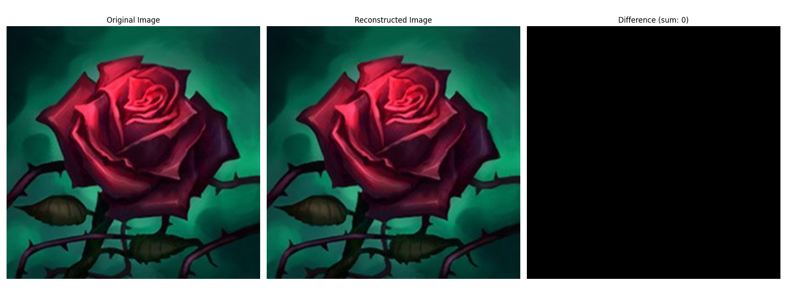
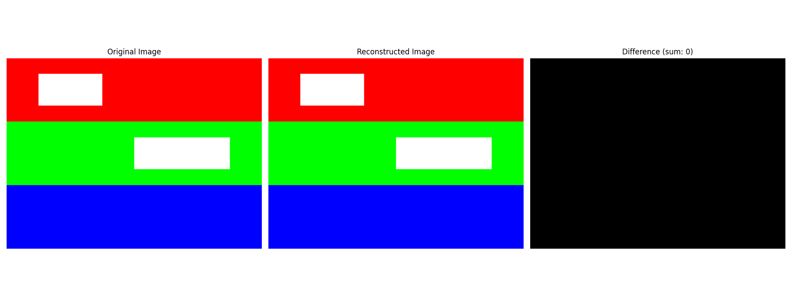

# Image Compression Algorithms - PNG & GIF

A course project on information theory that implements the core lossless compression algorithms used in PNG and GIF image formats: LZW (Lempel-Ziv-Welch), Deflate (LZ77 + Huffman coding).

## LZW Compression

The `lzw.py` module implements the Lempel-Ziv-Welch (LZW) lossless compression algorithm. It provides `compress()` and `uncompress()` functions that build a dictionary of character sequences during compression, using numerical codes to represent repeated patterns.

The `test_lzw.py` script demonstrates the algorithm's effectiveness:

- **Complex images**: On `rose.bmp` (270,054 bytes), LZW achieves a 1.10:1 compression ratio (8.82% space saved), successfully reconstructing the image with perfect data integrity.

  

- **Repetitive images**: On horizontally repetitive images like `test_repetitive.bmp` (1,440,054 bytes), LZW excels with a 262.35:1 compression ratio (99.62% space saved), demonstrating the algorithm's strength in compressing data with repeated patterns.

  
